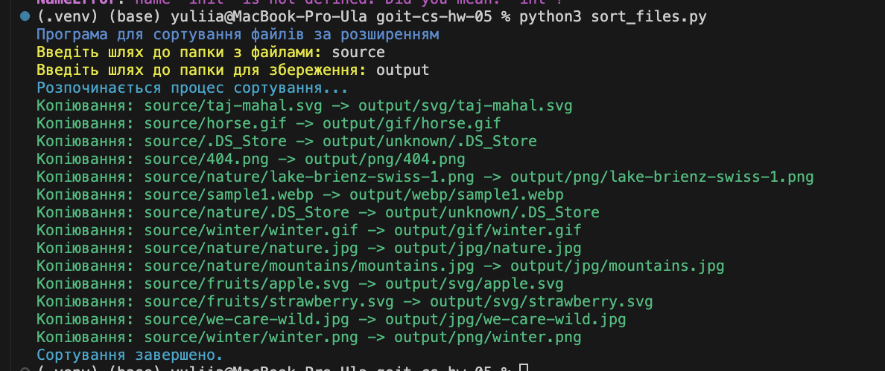
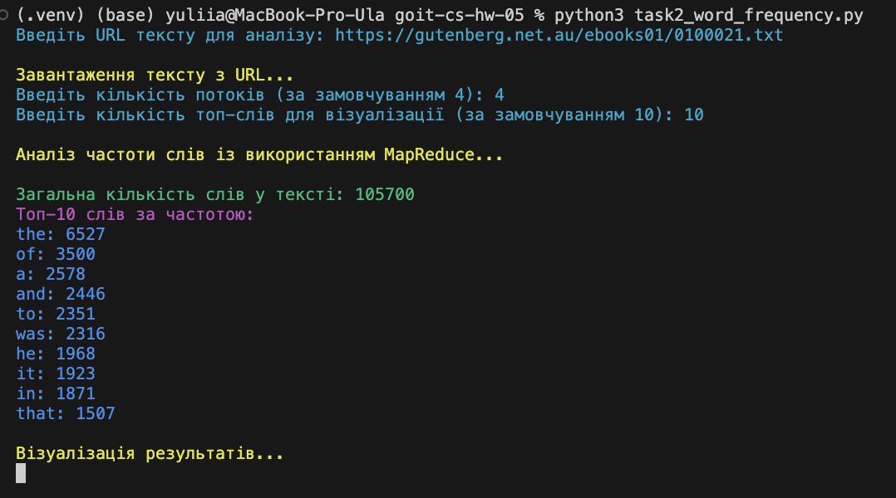
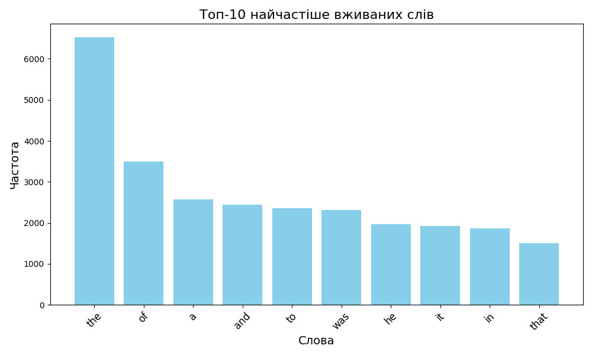

# Домашнє завдання до модуля “Асинхронна обробка”

Вітаємо! 🧠

У світі сучасних інформаційних технологій обробка великої кількості даних
вимагає ефективних та швидких методів. Завдання, яке перед вами стоїть, полягає
в написанні Python-скриптів, один з яких застосовує асинхронні можливості для
сортування файлів у папках, інший — парадигму MapReduce для аналізу частоти
використання слів у тексті та візуалізує результати.

Виконання цього домашнього завдання сприятиме розвитку навичок асинхронного
програмування та ефективної обробки файлів у великих обсягах. Завдяки йому ви:

- відпрацюєте навички використання бібліотек для асинхронного програмування та
  оптимізації швидкодії, реалізуєте асинхронні функції для рекурсивного читання
  та сортування файлів;
- реалізуєте на практиці використання паралельних можливостей Python для
  прискорення виконання коду.

> [!NOTE]
>
> Асинхронна обробка стає невід'ємною частиною реальних проєктів у галузі
> програмування. Здатність ефективно працювати з асинхронним кодом важлива для
> спеціалістів, які стикаються з великими обсягами даних, високими
> навантаженнями та потребують швидкісного виконання операцій у реальному часі.

Нумо починати?! 💪🏼

### Підготовка та завантаження домашнього завдання

1. Створіть публічний репозиторій `goit-cs-hw-05`.
2. Виконайте завдання та відправте його у свій репозиторій.
3. Завантажте робочі файли на свій комп’ютер та прикріпіть їх в LMS у форматі
   `zip`. Назва архіву повинна бути у форматі ДЗ5_ПІБ.
4. Прикріпіть посилання на репозиторій `goit-cs-hw-05` та відправте на
   перевірку.

### Формат оцінювання

- Залік/незалік

### Формат здачі

- Прикріплені файли репозиторію у форматі zip із назвою ДЗ5_ПІБ.
- Посилання на репозиторій.

## Технiчний опис завдання

Домашнє завдання складається з двох незалежних завдань.

## Завдання 1

Напишіть Python-скрипт, який буде читати всі файли у вказаній користувачем
вихідній папці (source folder)

### Покрокова інструкція

1. Імпортуйте необхідні асинхронні бібліотеки.
2. Створіть об'єкт `ArgumentParser` для обробки аргументів командного рядка.
3. Додайте необхідні аргументи для визначення вихідної та цільової папок.
4. Ініціалізуйте асинхронні шляхи для вихідної та цільової папок.
5. Напишіть асинхронну функцію `read_folder`, яка рекурсивно читає всі файли у
   вихідній папці та її підпапках.
6. Напишіть асинхронну функцію `copy_file`, яка копіює кожен файл у відповідну
   підпапку у цільовій папці на основі його розширення.
7. Налаштуйте логування помилок.
8. Запустіть асинхронну функцію `read_folder` у головному блоці.

### Критерії прийняття

- Код виконує асинхронне читання та копіювання файлів.
- Файли розподілено по підпапках на основі їх розширень.
- Програма обробляє аргументи командного рядка.
- Усі помилки логовано.
- Код читабельний та відповідає стандартам PEP 8.

> [!TIP]
>
> Критерії прийняття домашнього завдання є обов’язковою умовою розгляду
> домашнього завдання ментором. Якщо якийсь з критеріїв не виконано, ДЗ
> відправляється ментором на доопрацювання без оцінювання. Якщо вам “тільки
> уточнити”😉 або ви “застопорилися” на якомусь з етапів виконання— звертайтеся
> до ментора у Slack)

## Завдання 2

Напишіть Python-скрипт, який завантажує текст із заданої URL-адреси, аналізує
частоту використання слів у тексті за допомогою парадигми MapReduce і візуалізує
топ-слова з найвищою частотою використання у тексті.

### Покрокова інструкція

1. Імпортуйте необхідні модулі (`matplotlib` та інші).
2. Візьміть код реалізації MapReduce з конспекту.
3. Створіть функцію `visualize_top_words` для візуалізації результатів.
4. У головному блоці коду отримайте текст за URL, застосуйте MapReduce та
   візуалізуйте результати.

### Критерії прийняття

- Код завантажує текст із заданої URL-адреси.
- Код виконує аналіз частоти слів із використанням MapReduce.
- Візуалізація відображає топ-слова за частотою використання.
- Код використовує багатопотоковість.
- Код читабельний та відповідає стандартам PEP 8.

### Результат виконаного завдання № 1

### Результат виконаного завдання № 2

